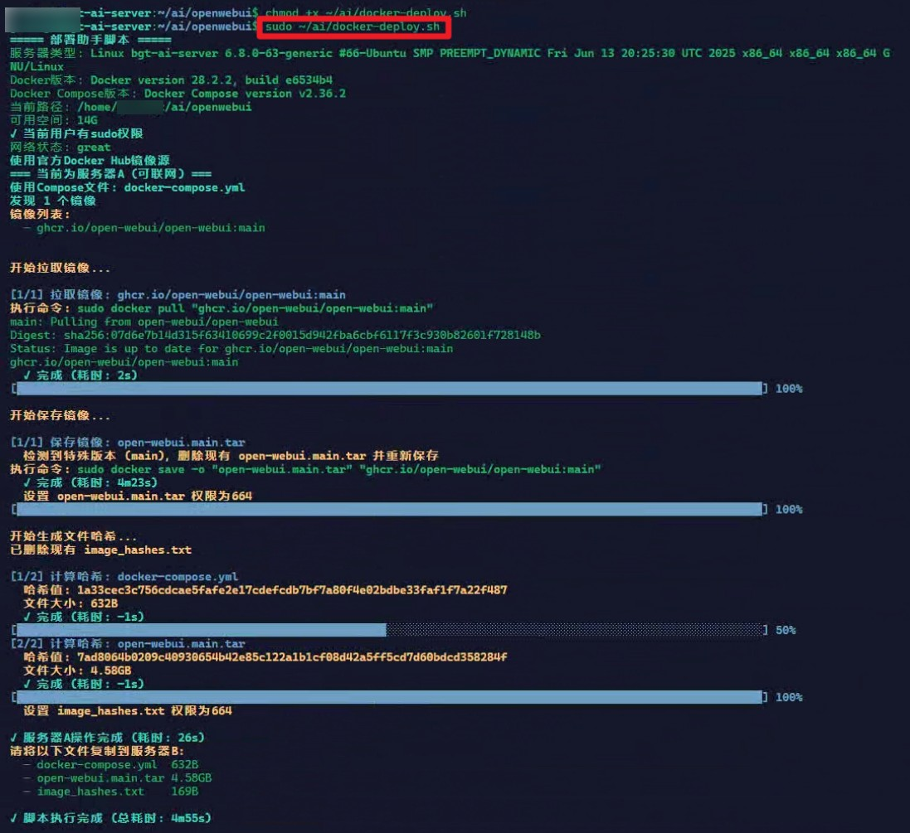
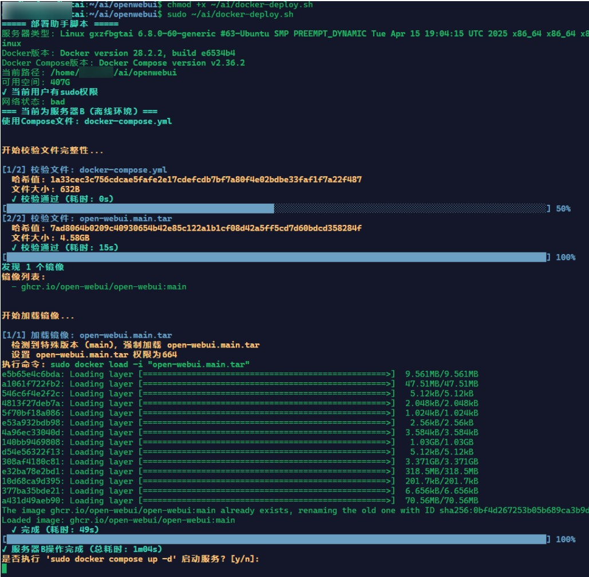

# Docke-Depoly.sh
借助一台联网服务器，一键在离线服务器上部署任意docker compose
# 应用场景说明
你有两台Linux服务器A、B，其中服务器A可以联网，服务器B不可联网，而你需要在服务器上部署docker compose应用。
## 解决思路
1. 在服务器A上使用```docker pull```命令，逐一拉取docker compose中的镜像。
2. 在服务器A上使用```docker save```命令，逐一保存拉下来的镜像。
3. 在服务器A上将tar镜像包线下手段拷贝到服务器B上。
4. 在服务器B上使用```docker load```命令，逐一加载tar镜像包。
5. 使用```docker compose up -d```正常启动应用。
## 本脚本功能
1. 自动判断当前为服务器A还是服务器B。
2. 将上述解决思路步骤自动化（当然还是要线下手段拷贝tar镜像）。
# 使用说明
1. 将脚本拷贝到服务器上，假设路径为 ```~```。
2. 执行```chmod +x ~/docker-deploy.sh```授予执行权限。
3. cd 到存有docker-compose.yml文件的目录，执行```sudo ~/docker-deploy.sh```

# 运行截图
## 服务器A（联网）


## 服务器B（不联网）

